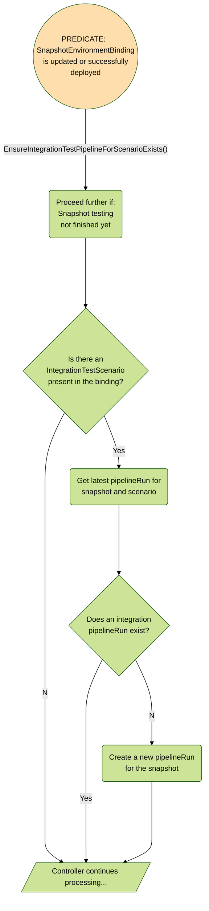

```mermaid
%%{init: {'theme':'forest'}}%%
flowchart TD
  %% Defining the styles
    classDef Red fill:#FF9999;
    classDef Amber fill:#FFDEAD;
    classDef Green fill:#BDFFA4;

  predicate((PREDICATE:  <br>SnapshotEnvironmentBinding<br>is updated or successfully<br>deployed))

%%%%%%%%%%%%%%%%%%%%%%% Drawing EnsureIntegrationTestPipelineForScenarioExists() function

%% Node definitions
ensure1(Proceed further if:<br>Snapshot testing <br> not finished yet)
isThereAnITS{"Is there an<br>IntegrationTestScenario<br>present in the binding?"}
continueProcessing1[/Controller continues processing.../]
getLatestPipelineRun("Get latest pipelineRun for<br>snapshot and scenario")
isPipelineRunExisting{"Does an integration<br>pipelineRun exist?"}
createNewPipelineRun("Create a new pipelineRun<br>for the snapshot")


%% Node connections
predicate               ----> |"EnsureIntegrationTestPipelineForScenarioExists()"|ensure1
ensure1                 ---->       isThereAnITS
isThereAnITS            --No-->     continueProcessing1
isThereAnITS            --Yes-->    getLatestPipelineRun
getLatestPipelineRun    ---->       isPipelineRunExisting
isPipelineRunExisting   --Yes-->    continueProcessing1
isPipelineRunExisting   --No-->     createNewPipelineRun
createNewPipelineRun    ---->       continueProcessing1

%% Assigning styles to nodes
class predicate Amber;
```
