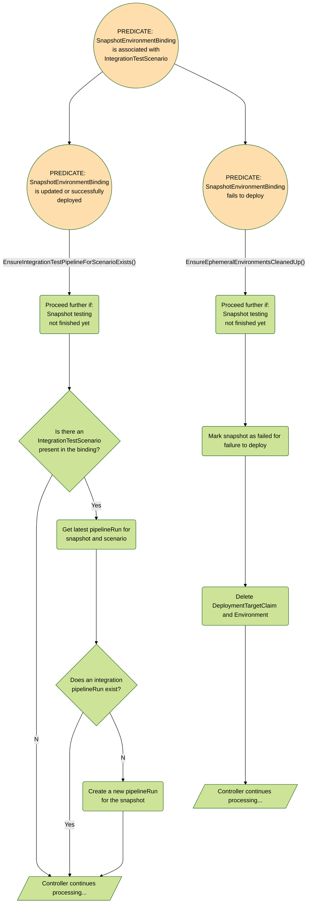

```mermaid
%%{init: {'theme':'forest'}}%%
flowchart TD
  %% Defining the styles
    classDef Red fill:#FF9999;
    classDef Amber fill:#FFDEAD;
    classDef Green fill:#BDFFA4;

predicate_integration_seb((PREDICATE: <br>SnapshotEnvironmentBinding<br>is associated with<br>IntegrationTestScenario))
predicate_deploy_success((PREDICATE:  <br>SnapshotEnvironmentBinding<br>is updated or successfully<br>deployed))

%%%%%%%%%%%%%%%%%%%%%%% Drawing EnsureIntegrationTestPipelineForScenarioExists() function

%% Node definitions
ensure1(Proceed further if:<br>Snapshot testing <br> not finished yet)
isThereAnITS{"Is there an<br>IntegrationTestScenario<br>present in the binding?"}
continueProcessing1[/Controller continues processing.../]
getLatestPipelineRun("Get latest pipelineRun for<br>snapshot and scenario")
isPipelineRunExisting{"Does an integration<br>pipelineRun exist?"}
createNewPipelineRun("Create a new pipelineRun<br>for the snapshot")

%% Node connections
predicate_integration_seb  ---->       predicate_deploy_success
predicate_deploy_success   ---->       |"EnsureIntegrationTestPipelineForScenarioExists()"|ensure1
ensure1                    ---->       isThereAnITS
isThereAnITS               --No-->     continueProcessing1
isThereAnITS               --Yes-->    getLatestPipelineRun
getLatestPipelineRun       ---->       isPipelineRunExisting
isPipelineRunExisting      --Yes-->    continueProcessing1
isPipelineRunExisting      --No-->     createNewPipelineRun
createNewPipelineRun       ---->       continueProcessing1

predicate_deploy_fail((PREDICATE:  <br>SnapshotEnvironmentBinding<br>fails to deploy))

%%%%%%%%%%%%%%%%%%%%%%% Drawing EnsureEphemeralEnvironmentsCleanedUp() function

%% Node definitions
ensure2(Proceed further if:<br>Snapshot testing <br> not finished yet)
markSnapshot("Mark snapshot as failed for failure to deploy")
cleanupDeploymentArtifacts("Delete DeploymentTargetClaim and Environment")
continueProcessing2[/Controller continues processing.../]

%% Node connections
predicate_integration_seb    ---->       predicate_deploy_fail
predicate_deploy_fail        ---->       |"EnsureEphemeralEnvironmentsCleanedUp()"|ensure2
ensure2                      ---->       markSnapshot
markSnapshot                 ---->       cleanupDeploymentArtifacts
cleanupDeploymentArtifacts   ---->       continueProcessing2

%% Assigning styles to nodes
class predicate_deploy_success Amber;
class predicate_deploy_fail Amber;
class predicate_integration_seb Amber;
```
