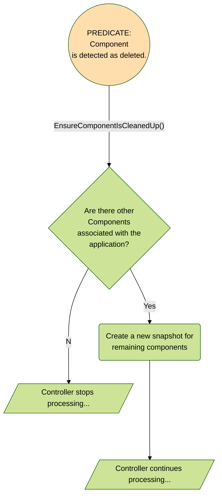

```mermaid
%%{init: {'theme':'forest'}}%%
flowchart TD
  %% Defining the styles
    classDef Red fill:#FF9999;
    classDef Amber fill:#FFDEAD;
    classDef Green fill:#BDFFA4;


predicate_deletion_detected((PREDICATE:  <br>Component<br>is detected as deleted.))

%%%%%%%%%%%%%%%%%%%%%%% Drawing EnsureComponentIsCleanedUp() function

%% Node definitions
isThereReamainingComponent{"Are there other<br>Components<br>associated with the<br>application?"}
stopProcessing[/Controller stops processing.../]
continueProcessing[/Controller continues processing.../]
createUpdatedSnapshot("Create a new snapshot for<br>remaining components")

%% Node connections

predicate_deletion_detected   ---->       |"EnsureComponentIsCleanedUp()"|isThereReamainingComponent
isThereReamainingComponent    --No-->     stopProcessing
isThereReamainingComponent    --Yes-->    createUpdatedSnapshot
createUpdatedSnapshot         ---->       continueProcessing


%% Assigning styles to nodes
class predicate_deletion_detected Amber;
```
