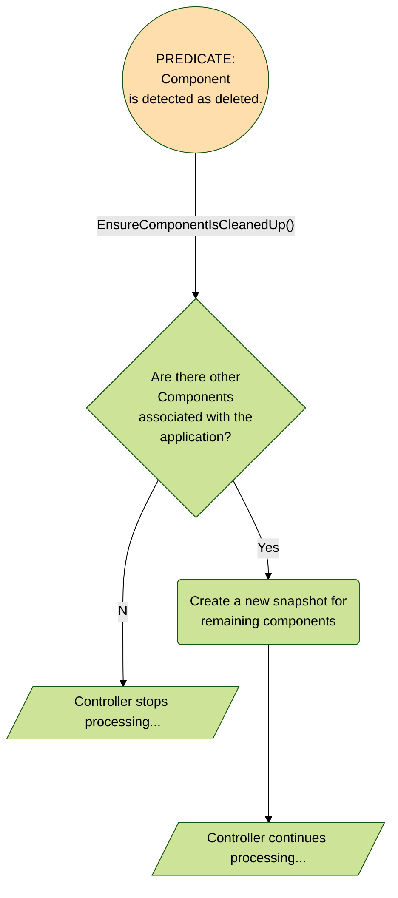
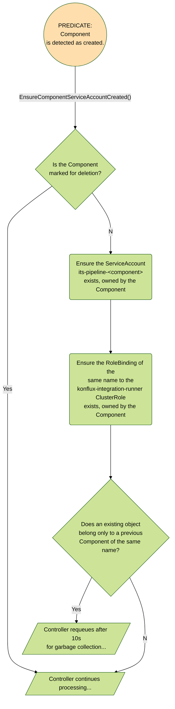

```mermaid
%%{init: {'theme':'forest'}}%%
flowchart TD
  %% Defining the styles
    classDef Red fill:#FF9999;
    classDef Amber fill:#FFDEAD;
    classDef Green fill:#BDFFA4;


predicate_deletion_detected((PREDICATE:  <br>Component<br>is detected as deleted.))

%%%%%%%%%%%%%%%%%%%%%%% Drawing EnsureComponentIsCleanedUp() function

%% Node definitions
isThereReamainingComponent{"Are there other<br>Components<br>associated with the<br>application?"}
stopProcessing[/Controller stops processing.../]
continueProcessing[/Controller continues processing.../]
createUpdatedSnapshot("Create a new snapshot for<br>remaining components")

%% Node connections

predicate_deletion_detected   ---->       |"EnsureComponentIsCleanedUp()"|isThereReamainingComponent
isThereReamainingComponent    --No-->     stopProcessing
isThereReamainingComponent    --Yes-->    createUpdatedSnapshot
createUpdatedSnapshot         ---->       continueProcessing


%% Assigning styles to nodes
class predicate_deletion_detected Amber;
```

```mermaid
%%{init: {'theme':'forest'}}%%
flowchart TD
  %% Defining the styles
    classDef Red fill:#FF9999;
    classDef Amber fill:#FFDEAD;
    classDef Green fill:#BDFFA4;


predicate_creation_detected((PREDICATE:  <br>Component<br>is detected as created.))

%%%%%%%%%%%%%%%%%%%%%%% Drawing EnsureComponentServiceAccountCreated() function

%% Node definitions
isMarkedForDeletion{"Is the Component<br>marked for deletion?"}
ensureServiceAccount("Ensure the ServiceAccount<br>its-pipeline-&lt;component&gt;<br>exists, owned by the Component")
ensureRoleBinding("Ensure the RoleBinding of the<br>same name to the<br>konflux-integration-runner ClusterRole<br>exists, owned by the Component")
isStaleOwner{"Does an existing object<br>belong only to a previous<br>Component of the same name?"}
requeueProcessing[/Controller requeues after 10s<br>for garbage collection.../]
continueProcessing2[/Controller continues processing.../]

%% Node connections

predicate_creation_detected   ---->       |"EnsureComponentServiceAccountCreated()"|isMarkedForDeletion
isMarkedForDeletion           --Yes-->    continueProcessing2
isMarkedForDeletion           --No-->     ensureServiceAccount
ensureServiceAccount          ---->       ensureRoleBinding
ensureRoleBinding             ---->       isStaleOwner
isStaleOwner                  --Yes-->    requeueProcessing
isStaleOwner                  --No-->     continueProcessing2


%% Assigning styles to nodes
class predicate_creation_detected Amber;
```

In the Application model the operations run in the order finalizer, ServiceAccount, cleanup. A Component without an Application runs only the ServiceAccount operation.
