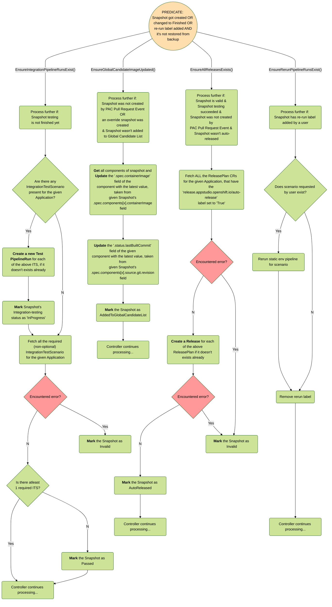

<h1>Snapshot Controller</h1>

```mermaid
%%{init: {'theme':'forest'}}%%
flowchart TD
  %% Defining the styles
    classDef Red fill:#FF9999;
    classDef Amber fill:#FFDEAD;
    classDef Green fill:#BDFFA4;

  predicate((PREDICATE: <br>Snapshot got created OR <br> changed to Finished OR <br> re-run label added AND <br> it's not restored from backup))

  %%%%%%%%%%%%%%%%%%%%%%% Drawing EnsureIntegrationPipelineRunsExist() function

  %% Node definitions
  ensure1(Process further if: Snapshot testing <br>is not finished yet)
  are_there_any_ITS{"Are there any <br>IntegrationTestScenario <br>present for the given <br>Application?"}
  create_new_test_PLR(<b>Create a new Test PipelineRun</b> for each <br>of the above ITS, if it doesn't exists already)
  mark_snapshot_InProgress(<b>Mark</b> Snapshot's Integration-testing <br>status as 'InProgress')
  fetch_all_required_ITS("Fetch all the required <br>(non-optional) IntegrationTestScenario <br>for the given Application")
  encountered_error1{Encountered error?}
  mark_snapshot_Invalid1(<b>Mark</b> the Snapshot as Invalid)
  is_atleast_1_required_ITS{Is there atleast <br>1 required ITS?}
  mark_snapshot_passed(<b>Mark</b> the Snapshot as Passed)
  continue_processing1(Controller continues processing...)

  %% Node connections
  predicate                 ---->    |"EnsureIntegrationPipelineRunsExist()"|ensure1
  ensure1                   -->      are_there_any_ITS
  are_there_any_ITS         --Yes--> create_new_test_PLR
  are_there_any_ITS         --No-->  fetch_all_required_ITS
  create_new_test_PLR       -->      mark_snapshot_InProgress
  mark_snapshot_InProgress  -->      fetch_all_required_ITS
  fetch_all_required_ITS    -->      encountered_error1
  encountered_error1        --No-->  is_atleast_1_required_ITS
  encountered_error1        --Yes--> mark_snapshot_Invalid1
  is_atleast_1_required_ITS --Yes--> continue_processing1
  is_atleast_1_required_ITS --No-->  mark_snapshot_passed
  mark_snapshot_passed      -->      continue_processing1


  %%%%%%%%%%%%%%%%%%%%%%% Drawing EnsureGlobalCandidateImageUpdated() function

  %% Node definitions
  ensure2(Process further if: <br>Snapshot was not created by PAC Pull Request Event OR <br>an override snapshot was created <br>& Snapshot wasn't added to Global Candidate List)
  update_container_image("<b>Get</b> all components of snapshot and <br><b>Update</b> the '.spec.containerImage' field of the <br>component with the latest value, taken from <br>given Snapshot's .spec.components[x].containerImage field")
  update_last_built_commit("<b>Update</b> the '.status.lastBuiltCommit' field of the given <br>component with the latest value, taken from <br>given Snapshot's .spec.components[x].source.git.revision field")
  mark_snapshot_added_to_GCL(<b>Mark</b> the Snapshot as AddedToGlobalCandidateList)
  continue_processing2(Controller continues processing...)

  %% Node connections
  predicate                ----> |"EnsureGlobalCandidateImageUpdated()"|ensure2
  ensure2                    -->    update_container_image
  update_container_image     -->    update_last_built_commit
  update_last_built_commit   -->    mark_snapshot_added_to_GCL
  mark_snapshot_added_to_GCL -->    continue_processing2


  %%%%%%%%%%%%%%%%%%%%%%% Drawing EnsureAllReleasesExists() function

  %% Node definitions
  ensure3(Process further if: Snapshot is valid & <br>Snapshot testing succeeded & <br>Snapshot was not created by <br>PAC Pull Request Event & <br> Snapshot wasn't auto-released)
  fetch_all_ReleasePlans("Fetch ALL the ReleasePlan CRs <br>for the given Application, that have the <br>'release.appstudio.openshift.io/auto-release' <br>label set to 'True'")
  encountered_error31{Encountered error?}
  create_Release(<b>Create a Release</b> for each of the above <br>ReleasePlan if it doesn't exists already)
  encountered_error32{Encountered error?}
  mark_snapshot_Invalid3(<b>Mark</b> the Snapshot as Invalid)
  mark_snapshot_autoreleased(<b>Mark</b> the Snapshot as AutoReleased)
  continue_processing3(Controller continues processing...)

  %% Node connections
  predicate              ---->    |"EnsureAllReleasesExists()"|ensure3
  ensure3                -->      fetch_all_ReleasePlans
  fetch_all_ReleasePlans -->      encountered_error31
  encountered_error31    --No-->  create_Release
  encountered_error31    --Yes--> mark_snapshot_Invalid3
  create_Release         -->      encountered_error32
  encountered_error32    --No-->  mark_snapshot_autoreleased
  mark_snapshot_autoreleased -->  continue_processing3
  encountered_error32    --Yes--> mark_snapshot_Invalid3


  %%%%%%%%%%%%%%%%%%%%%%% Drawing EnsureRerunPipelineRunsExist() function

  %% Node definitions
  ensure6(Process further if: Snapshot has re-run label added by a user)
  if_scenario_exist{Does scenario requested by user exist?}
  remove_rerun_label(Remove rerun label)
  rerun_static_env(Rerun static env pipeline for scenario)
  continue_processing6(Controller continues processing...)

  %% Node connections
  predicate                       ---->    |"EnsureRerunPipelineRunsExist()"|ensure6
  ensure6                         -->      if_scenario_exist
  if_scenario_exist               --Yes--> rerun_static_env
  if_scenario_exist               --No-->  remove_rerun_label
  remove_rerun_label              ---->    continue_processing6
  rerun_static_env                ---->    remove_rerun_label


  %% Assigning styles to nodes
  class predicate Amber;
  class encountered_error1,encountered_error31,encountered_error32,encountered_error5 Red;
```
