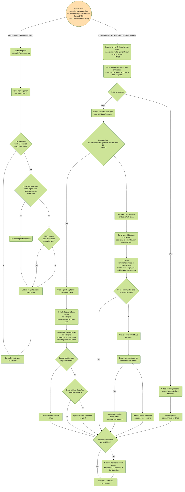

<h1>StatusReport Controller</h1>

```mermaid
%%{init: {'theme':'forest'}}%%
flowchart TD
  %% Defining the styles
    classDef Amber fill:#FFDEAD;

  predicate((PREDICATE: <br>Snapshot has annotation <br>test.appstudio.openshift.io/status <br>changed AND <br> it's not restored from backup))

%%%%%%%%%%%%%%%%%%%%%%% Drawing EnsureSnapshotFinishedAllTests() function

%% Node definitions
  
  get_required_scenarios(Get all required <br> IntegrationTestScenarios)
  parse_snapshot_status(Parse the Snapshot's <br> status annotation)
  check_finished_tests{Did Snapshot <br> finish all required <br> integration tests?}
  check_supersede{Does Snapshot need <br> to be superseded <br> with a composite Snapshot?}
  check_passed_tests{Did Snapshot <br> pass all required <br> integration tests?}
  create_snapshot(Create composite Snapshot)
  update_status(Update Snapshot status accordingly)
  continue_processing_tests(Controller continues processing)


%% Node connections
  predicate                    ---->    |"EnsureSnapshotFinishedAllTests()"|get_required_scenarios
  get_required_scenarios        --->    parse_snapshot_status
  parse_snapshot_status         --->    check_finished_tests
  check_finished_tests      --Yes-->    check_supersede
  check_finished_tests       --No-->    continue_processing_tests
  check_supersede           --Yes-->    create_snapshot
  check_supersede            --No-->    check_passed_tests
  create_snapshot               --->    update_status
  check_passed_tests        --Yes-->    update_status
  check_passed_tests         --No-->    update_status
  update_status                ---->    continue_processing_tests

  %%%%%%%%%%%%%%%%%%%%%%% Drawing EnsureSnapshotTestStatusReportedToGitProvider() function

  %% Node definitions
  ensure(Process further if: Snapshot has label <br>pac.test.appstudio.openshift.io/git-provider:github <br>defined)
  get_annotation_value(Get integration test status from annotation <br>test.appstudio.openshift.io/status <br>from Snapshot)

  detect_git_provider{Detect git provider}

  collect_commit_info_gh(Collect commit owner, repo and SHA from Snapshot)

  is_installation_defined{Is annotation <br>pac.test.appstudio.openshift.io/installation-id <br>defined?}

  create_appInstallation_token(Create github application installation token)
  get_all_checkRuns_from_gh(Get all checkruns from github <br>according to <br>commit owner, repo and SHA)
  create_checkRunAdapter(Create checkRun adapter according to <br>commit owner, repo, SHA <br>and integration test status)
  does_checkRun_exist{Does checkRun exist <br>on github already?}
  create_new_checkRun_on_gh(Create new checkrun on github)
  is_checkRun_update_needed{Does existing checkRun <br>have different text?}
  update_existing_checkRun_on_gh(Update existing checkRun on github)

  set_oAuth_token(Get token from Snapshot and set oAuth token)
  get_all_commitStatuses_from_gh(Get all commitStatuses from github <br>according to commit owner, repo and SHA)
  create_commitStatusAdapter(Create commitStatusAdapter according to <br>commit owner, repo, SHA <br>and integration test status)
  does_commitStatus_exist{Does commitStatus exist <br>on github already?}
  create_new_commitStatus_on_gh(Create new commitStatus on github)
  does_comment_exist(Does a comment exist for snapshot and scenario?)
  update_existing_comment(Update the existing comment for <br>snapshot and scenario</br>)
  create_new_comment(Create a new comment for <br>snapshot and scenario</br>)

  collect_commit_info_gl(Collect commit projectID, repo-url and SHA from Snapshot)
  report_commit_status_gl(Create/update commitStatus on Gitlab)

  is_snapshot_marked{Is <br>Snapshot marked as <br>passed/failed?}
  remove_finalizer_from_all_intg_plr(Remove the finalizer from all the <br>Integration PLRs related to the Snapshot)

  continue_processing(Controller continues processing)

  %% Node connections
  predicate                      ---->    |"EnsureSnapshotTestStatusReportedToGitProvider()"|ensure
  ensure                         -->      get_annotation_value
  get_annotation_value           -->      detect_git_provider
  detect_git_provider            --github--> collect_commit_info_gh
  detect_git_provider            --gitlab--> collect_commit_info_gl
  collect_commit_info_gh         --> is_installation_defined
  is_installation_defined        --Yes--> create_appInstallation_token
  is_installation_defined        --No--> set_oAuth_token

  create_appInstallation_token   --> get_all_checkRuns_from_gh
  get_all_checkRuns_from_gh      --> create_checkRunAdapter
  create_checkRunAdapter         --> does_checkRun_exist
  does_checkRun_exist            --Yes--> is_checkRun_update_needed
  does_checkRun_exist            --No--> create_new_checkRun_on_gh
  create_new_checkRun_on_gh      --> is_snapshot_marked
  is_checkRun_update_needed      --Yes--> update_existing_checkRun_on_gh
  is_checkRun_update_needed      --No--> is_snapshot_marked
  update_existing_checkRun_on_gh --> is_snapshot_marked

  set_oAuth_token                --> get_all_commitStatuses_from_gh
  get_all_commitStatuses_from_gh --> create_commitStatusAdapter
  create_commitStatusAdapter     --> does_commitStatus_exist
  does_commitStatus_exist        --Yes--> is_snapshot_marked
  does_commitStatus_exist        --No--> create_new_commitStatus_on_gh
  create_new_commitStatus_on_gh  --> does_comment_exist
  does_comment_exist             --Yes--> update_existing_comment
  does_comment_exist             --No--> create_new_comment
  update_existing_comment        --> is_snapshot_marked
  create_new_comment             --> is_snapshot_marked

  collect_commit_info_gl         --> report_commit_status_gl
  report_commit_status_gl        --> is_snapshot_marked

  is_snapshot_marked                 --Yes--> remove_finalizer_from_all_intg_plr
  is_snapshot_marked                 --No --> continue_processing
  remove_finalizer_from_all_intg_plr -->      continue_processing

  %% Assigning styles to nodes
  class predicate Amber;
```
